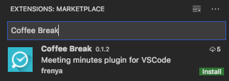

# Introduction

Coffee Break is an extension of Microsoft's Visual Studio Code for efficient meeting minutes management. It covers the following main functionalities

- Write meeting minutes in an open Markdown format
- Preview your minutes as formatted HTML and send to meeting participants
- Mark actions within notes, assign owners and due dates
- View all open actions and filter them using owner and due date

You can store your notes on any cloud filesystem (Dropbox, Google Drive, etc.) and have them available everywhere.

# Installation

## Install Visual Studio Code

Go to [Visual Studio Code pages](https://code.visualstudio.com/) and download the latest version for your operating system.

## Install the Coffee Break plugin

Run Visual Studio Code and install the Coffee Break extension by doing the following

- choose View -> Extensions from the menu (or press Shift-Ctrl-X, Shift-Cmd-X on Mac)
- search for Coffee Break
- tap the Install button

NOTE: The extension "Markdown All In One" will be installed as well. It greatly improves Markdown writing in VS Code.

# Start taking notes

Coffee Break can operate in one of two modes

- **Single Notebook** - all your notes (as well as all configuration) are stored in a single folder on your filesystem. The same configuration is used for all notes.
- **Workspace with multiple Notebooks** - your main configuration is stored in a "workspace" file (*.code-workspace). Multiple filesystem folder can be added to the workspace and configuration can be finetuned for each of them.

Choose the multi-notebook setting when dealing with a more complex scenarios, e.g. create a workspace for all your work notes and add folders for individual projects.

## Markdown

Write your notes in Markdown and store them in .md files. For more information on Markdown, please visit [Markdown Guide](https://www.markdownguide.org/)

To see your note rendered as HTML, simply use the Markdown Preview functionality of VS Code.

## Basic Coffee Break functionality

Coffee Break adds the tools needed for taking meeting minutes in Markdown, namely

- mark task's in your bullet lists (Alt-Enter)
- complete/uncomplete tasks (Alt-D)
- add owner to a task with **@** mentions
- add due date to a task in YYYY-MM-DD notation
- easily enter dates with the // shortcut

Coffee Break also gives you an overview of all actions in a dedicated side panel. Tasks are grouped by Notebook and Owner. Task's icon reflect its due date. 

You can also filter the tasks by:

- **Owner** - click the User icon to show primary user's task. Click again to swith the filter off. Alt-Click to customize the filtering.
- **Due date** - click the Calendar icon to show tasks due today. Click again to swith the filter off. Alt-Click to customize the filter date.
- **Sync status** - by default, all tasks are shown. Click the Uplink icon to hide tasks that have been synchronized to an external task manager.
- **Full text** - click the Loupe icon to search for a specific text

## External sync

Coffee Break has been prepared for synchronization to an external task manager. Currently, the following sync plugins are available:

- [Sync to Todoist](http://example.com)

To run sync, simply press Shift-Ctrl-P (Shift-Cmd-P on Mac) and select the TBD command.

After successful sync, links to the external tasks should appear in your notes, e.g. .

## External sync configuration

There are three things to keep in mind when using the external sync:

- you need to configure the "Sync command" in Workspace/Folder Settings
- you can configure an "Owner Filter" in settings to only sync tasks of with a particular owner (typically your own)
- when running the sync for the first time, you will probably be asked to provide an authorization token for the external service - please see documentation of the sync plugin for details

# Various

## Quick note creation

Press Ctrl-Alt-N (Cmd-Alt-N on Mac) for quickly create a meeting note. You will be asked for a title of your note and after pressing Enter a file will be created with the name "YYYY-MM-DD <Note title>.md".

If you want the file to be created in a particular Notebook, simply type a comma (,) after the title and a few characters of the Notebooks's name.

## Single/Multi Notebook setup

When switching from a single notebook setup to multi notebook, your configuration will not be migrated. It is however stored as JSON and it is very easy to manually move the settings from the .vscode/settings.json file to the appropriate *.code-workspace file.